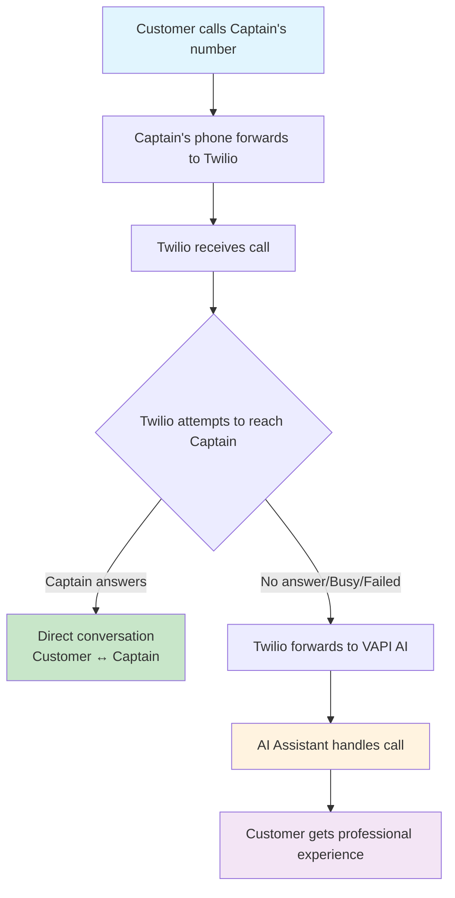
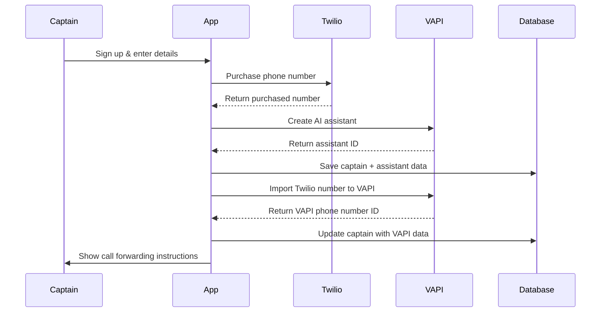
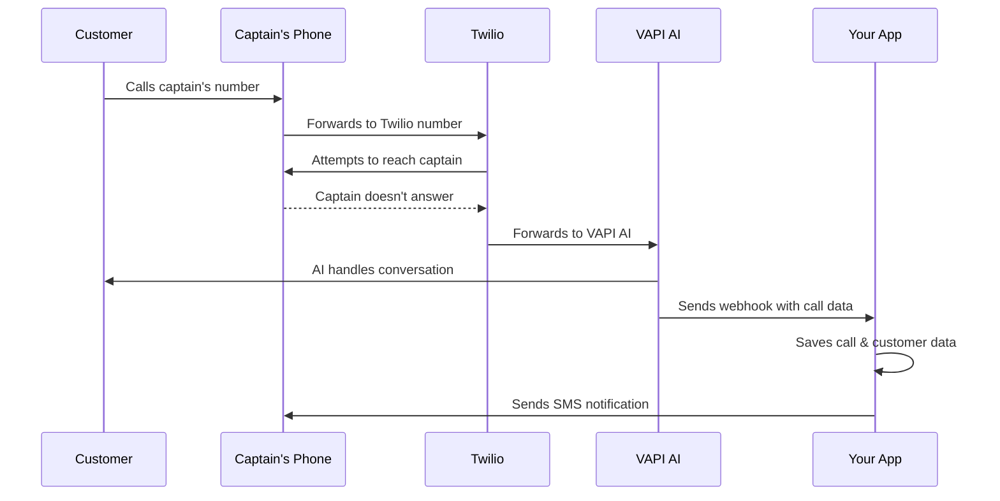
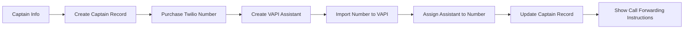
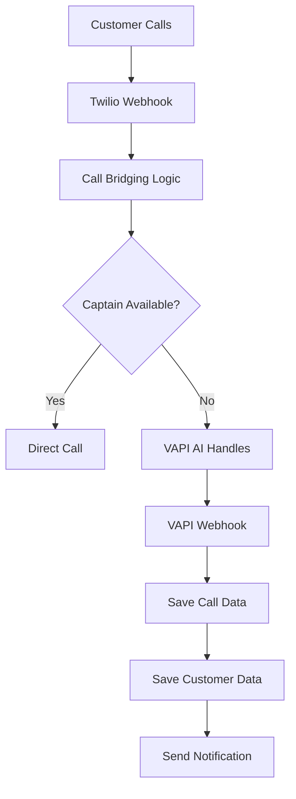

# Fishing Captain AI Assistant

A SaaS platform that provides AI phone assistants for fishing charter captains using VAPI and Twilio integration.

## 🎯 Problem Solved

Fishing captains lose customers when unreachable on the water. This platform provides an AI assistant that handles calls via Twilio call bridging, ensuring no customer is ever missed.

## 🏗️ Architecture Overview

### Tech Stack

- **Frontend**: Next.js 15+ (App Router)
- **Backend**: Next.js API Routes + MongoDB
- **Voice AI**: VAPI (handles OpenAI, speech processing, WebSockets)
- **Phone**: Twilio Voice + VAPI integration
- **Database**: MongoDB Atlas
- **Hosting**: Vercel (serverless)

### High-Level Architecture

```
┌─────────────────┐    ┌─────────────────┐    ┌─────────────────┐
│   Customer      │    │     Twilio      │    │      VAPI       │
│                 │    │                 │    │                 │
│ Calls Captain's │───▶│ Call Bridging   │───▶│ AI Assistant    │
│ Original Number │    │ & Fallback      │    │ (if needed)     │
└─────────────────┘    └─────────────────┘    └─────────────────┘
                                │
                                ▼
                       ┌─────────────────┐
                       │   Your App      │
                       │   (Next.js)     │
                       │                 │
                       │ • Webhooks      │
                       │ • Dashboard     │
                       │ • Analytics     │
                       └─────────────────┘
```

## 📞 Call Flow Architecture

### Twilio-First Call Bridging

We use **Twilio call bridging** to solve carrier conditional forwarding issues:



### Why This Architecture?

**Problem**: Carrier conditional forwarding codes are inconsistent:

- Verizon: `*71` (busy/no-answer), `*72` (unconditional)
- AT&T: `*67*` (busy), `*61*` (no-answer), `*62*` (unreachable)
- T-Mobile: `**67*1` (busy), `**61*1` (no-answer), `**62*1` (unreachable)

**Solution**: Use **unconditional forwarding** (`*72`) + **Twilio call bridging**:

- ✅ 100% reliable across all carriers
- ✅ Customer calls original number (no behavior change)
- ✅ AI only takes over when captain truly unavailable
- ✅ Works perfectly offshore when captain has no service

## 🔄 Complete Call Flow +

### 1. Captain Onboarding Flow



### 2. Live Call Flow



## 🚀 Key Features

### For Captains

- **Never miss a call** - AI handles when unavailable
- **Professional experience** - Customers get natural conversation
- **Offshore reliability** - Works when captain has no service
- **Dashboard** - View call history and customer data
- **Notifications** - SMS alerts for new leads

### For Customers

- **Same number** - Call captain's existing number
- **No waiting** - Immediate professional response
- **Natural conversation** - Sub-300ms response time
- **Structured data** - AI collects trip details automatically

### For Admins

- **Admin Dashboard** - Overview of all captains and business metrics
- **User Management** - View total captains, calls, and customers
- **Analytics** - Track business growth and performance
- **Direct Access** - Admins bypass captain onboarding and go straight to admin dashboard

## 📁 Project Structure

```
fishing-captain-phone-assistant/
├── app/
│   ├── api/
│   │   ├── auth/[...nextauth]/     # Authentication
│   │   ├── captains/               # Captain management
│   │   ├── twilio/
│   │   │   ├── webhook/            # Twilio call handling
│   │   │   ├── purchase-number/    # Number purchasing
│   │   │   └── carrier-lookup/     # Carrier detection
│   │   └── vapi/
│   │       ├── assistant/          # AI assistant creation
│   │       ├── phone-number/       # VAPI number import
│   │       └── webhook/            # VAPI event handling
│   ├── dashboard/                  # Captain dashboard
│   ├── onboarding/                 # Captain setup flow
│   └── auth/signin/               # Authentication pages
├── components/
│   ├── auth/                      # Auth components
│   ├── providers/                 # React providers
│   └── ui/                        # UI components
├── lib/
│   ├── models/                    # MongoDB schemas
│   ├── vapi.js                    # VAPI integration
│   └── mongodb.js                 # Database connection
└── docs/                          # Documentation
```

## 🔧 Environment Setup

### Required Environment Variables

```bash
# Database
MONGODB_URI=mongodb+srv://...

# Authentication
NEXTAUTH_SECRET=your-secret
NEXTAUTH_URL=http://localhost:3000
GOOGLE_CLIENT_ID=your-google-client-id
GOOGLE_CLIENT_SECRET=your-google-client-secret

# Twilio
TWILIO_ACCOUNT_SID=your-twilio-sid
TWILIO_AUTH_TOKEN=your-twilio-token

# VAPI
VAPI_API_KEY=your-vapi-api-key
VAPI_WEBHOOK_SECRET=your-webhook-secret

# App Configuration
NEXT_PUBLIC_BASE_URL=http://localhost:3000
ALLOW_REAL_PURCHASES=false  # Set to true for production

# Admin Access
ADMIN_EMAILS=admin@yourcompany.com,owner@yourcompany.com  # Comma-separated list of admin emails
```

### Installation

```bash
# Clone repository
git clone <repository-url>
cd fishing-captain-phone-assistant

# Install dependencies
npm install

# Set up environment
cp .env.example .env.local
# Edit .env.local with your credentials

# Run development server
npm run dev
```

## 🎯 API Endpoints

### Captain Management

- `POST /api/captains` - Create new captain
- `GET /api/captains` - List all captains
- `PATCH /api/captains/update-assistant` - Update assistant ID

### Twilio Integration

- `POST /api/twilio/purchase-number` - Purchase phone number
- `POST /api/twilio/webhook` - Handle incoming calls
- `POST /api/twilio/carrier-lookup` - Detect carrier

### VAPI Integration

- `POST /api/vapi/assistant` - Create AI assistant
- `POST /api/vapi/phone-number` - Import number to VAPI
- `POST /api/vapi/webhook` - Handle VAPI events

## 🔄 Data Flow

### Captain Onboarding Data Flow



### Call Data Flow



## 🛠️ Development

### Safety Mode

For development, we use Safety Mode to prevent accidental Twilio purchases:

```bash
# Enable Safety Mode (default)
ALLOW_REAL_PURCHASES=false

# Disable Safety Mode for production
ALLOW_REAL_PURCHASES=true
```

### Testing VAPI Integration

```bash
# Test VAPI connection
curl http://localhost:3000/api/test-vapi

# Test VAPI integration
curl http://localhost:3000/api/test-vapi

# Test webhook simulation
curl -X POST http://localhost:3000/api/test-webhook-simulation
```

## 📊 Database Schema

### Captain Model

```javascript
{
  _id: ObjectId,
  userId: String,
  captainName: String,
  businessName: String,
  phoneNumber: String,
  email: String,
  vapiAssistantId: String,
  twilioNumber: {
    phoneNumber: String,
    sid: String,
    vapiPhoneNumberId: String,
    assistantId: String,
    vapiIntegrationStatus: String
  },
  serviceEnabled: Boolean
}
```

### Call Model

```javascript
{
  _id: ObjectId,
  callId: String,
  captainId: ObjectId,
  assistantId: String,
  customerPhone: String,
  status: String,
  startedAt: Date,
  endedAt: Date,
  duration: Number,
  transcript: String,
  customerData: Object
}
```

## 🚀 Deployment

### Vercel Deployment

1. Connect GitHub repository to Vercel
2. Set environment variables in Vercel dashboard
3. Deploy automatically on push to main branch

### Production Checklist

- [ ] Set `ALLOW_REAL_PURCHASES=true`
- [ ] Update `NEXT_PUBLIC_BASE_URL` to production domain
- [ ] Configure VAPI webhook URL
- [ ] Set up Twilio webhook URL
- [ ] Test end-to-end call flow

## 🤝 Contributing

1. Fork the repository
2. Create a feature branch
3. Make your changes
4. Test thoroughly
5. Submit a pull request

## 📝 License

This project is licensed under the MIT License.

## 🆘 Support

For questions or issues:

- Check the documentation in `/docs`
- Review the API endpoints
- Test with Safety Mode enabled
- Check VAPI and Twilio logs

---

**Built with ❤️ for fishing captains who never want to miss a customer call.**
